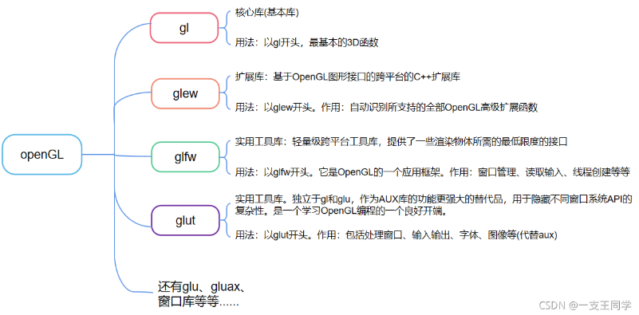

# OpenGL的环境配置

## 安装并配置相关文件

### 1. OpenGL、glew、glfw、glut之间的关系

### 2. 下载并安装和配置openGL、glew、glfw、glut

<1> openGL

<2> glew、glfw、glut

[glew](https://sourceforge.net/projects/glew/)

[glfw](https://www.glfw.org/download.html)
[glut](https://www.opengl.org/resources/libraries/glut/glut_downloads.php#3.7)